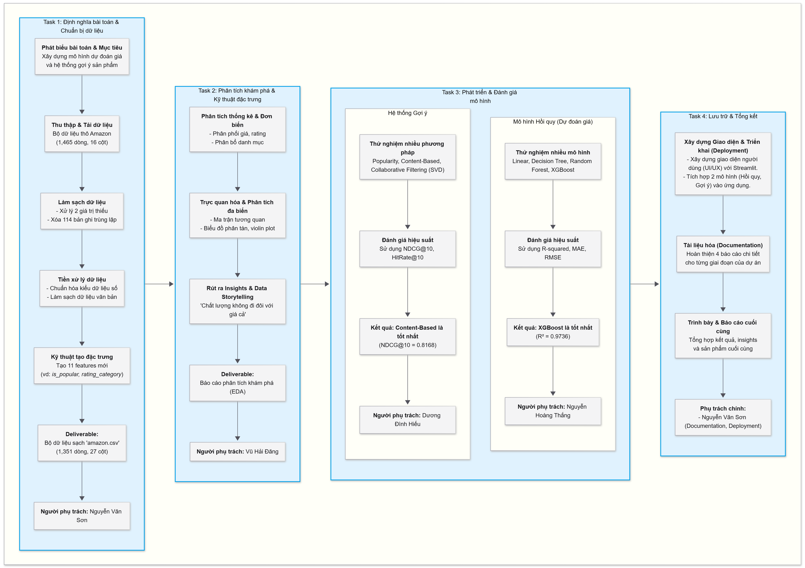

# **Phân tích Sản phẩm Amazon: Hệ thống Dự đoán Giá và Gợi ý Sản phẩm**

## **Tổng quan Dự án**

Dự án này là một sáng kiến khoa học dữ liệu toàn diện, tập trung vào việc phát triển và triển khai các mô hình học máy nâng cao cho phân tích thương mại điện tử. Dự án cung cấp một giải pháp kép cho dữ liệu sản phẩm của Amazon, bao gồm khả năng dự đoán giá và một hệ thống gợi ý kết hợp. Hệ thống minh họa toàn bộ quy trình khoa học dữ liệu, từ xử lý dữ liệu thô đến triển khai mô hình, đi kèm với một giao diện web tương tác để trực quan hóa và kiểm thử.

**Lưu ý quan trọng:** Phần giao diện web (Flask và React) được xây dựng như một **bản demo**, nhằm mục đích trình diễn tương tác với các mô hình đã huấn luyện. Đây không phải là một ứng dụng full-stack hoàn chỉnh được sản xuất hóa.

## **Mục tiêu Dự án**

- Phát triển một mô hình dự đoán giá chính xác sử dụng thuật toán hồi quy XGBoost.
- Triển khai một hệ thống gợi ý kết hợp (hybrid), kết hợp lọc dựa trên nội dung (content-based) và lọc cộng tác (collaborative filtering).
- Tạo dựng một quy trình khoa học dữ liệu đầu cuối (end-to-end) với tài liệu chi tiết cho từng giai đoạn.
- Xây dựng một giao diện web tương tác để trình diễn năng lực của các mô hình.

## **Đội ngũ Phát triển**

- **Nguyễn Văn Sơn** - Data Scientist (Lead)
- **Nguyễn Hoàng Thắng** - Machine Learning Engineer
- **Vũ Hải Đăng** - Data Analyst
- **Dương Đình Hiếu** - AI Engineer



---

## **Phương pháp Khoa học Dữ liệu**

Dự án tuân thủ một quy trình gồm bốn giai đoạn, mỗi giai đoạn tương ứng với một Jupyter Notebook và tài liệu giải thích chi tiết.

### **Giai đoạn 1: Thu thập và Tiền xử lý Dữ liệu** (`01_data_processing.ipynb` & `01_data_processing.md`)
- Thu thập dữ liệu từ nguồn gốc tại `data/raw/amazon.csv`.
- Thực hiện đánh giá chất lượng dữ liệu, xác định và xử lý các giá trị thiếu, dữ liệu bất thường và các kiểu dữ liệu không nhất quán.
- Áp dụng các kỹ thuật làm sạch: điền giá trị thiếu, loại bỏ ký tự không cần thiết, chuẩn hóa văn bản trong cột `about_product`.
- Chuyển đổi kiểu dữ liệu các cột quan trọng (`price`, `rating`) sang định dạng số phù hợp cho phân tích.
- Lưu trữ tập dữ liệu đã được xử lý tại `data/processed/amazon.csv`.

### **Giai đoạn 2: Phân tích Dữ liệu Khám phá (EDA)** (`02_eda_data.ipynb` & `02_eda_data.md`)
- Sử dụng Matplotlib và Seaborn để trực quan hóa phân phối thống kê của các biến số.
- Phân tích mối tương quan giữa các biến (giá, xếp hạng, số lượng đánh giá).
- Khám phá và xác định các danh mục sản phẩm phổ biến, phân tích các đặc điểm nổi bật của chúng.
- Rút ra những hiểu biết sâu sắc ban đầu từ dữ liệu để định hướng cho việc xây dựng mô hình.

### **Giai đoạn 3: Xây dựng Mô hình Dự đoán Giá** (`03_modeling_regression.ipynb` & `03_modeling_regression.md`)
- Lựa chọn và kỹ thuật các đặc trưng (features) phù hợp để tối ưu hóa việc dự đoán giá.
- Xây dựng pipeline tiền xử lý dữ liệu: sử dụng `OneHotEncoder` cho biến phân loại và `StandardScaler` cho biến số.
- Huấn luyện mô hình hồi quy **XGBoost** để dự đoán giá sản phẩm.
- Đánh giá hiệu suất mô hình thông qua các chỉ số đo lường như RMSE (Root Mean Squared Error) và R² (R-squared).
- Lưu trữ mô hình đã huấn luyện tại `models/price_prediction/xgboost_model.joblib`.

### **Giai đoạn 4: Phát triển Hệ thống Gợi ý Sản phẩm** (`04_recommendation_system.ipynb` & `04_recommendation_system.md`)
- Xây dựng một hệ thống gợi ý **kết hợp (hybrid)**.
  - **Lọc dựa trên Nội dung (Content-Based Filtering):** Sử dụng TF-IDF để vector hóa văn bản mô tả sản phẩm (`about_product`) và tính toán độ tương đồng cosine.
  - **Lọc Cộng tác (Collaborative Filtering):** Xây dựng ma trận người dùng-sản phẩm và áp dụng thuật toán SVD (Singular Value Decomposition) để tìm các sản phẩm tương tự.
- Kết hợp kết quả từ hai phương pháp để tạo ra danh sách gợi ý cuối cùng, tăng độ chính xác và đa dạng.
- Lưu trữ mô hình gợi ý tại `models/recommendation/hybrid_model.joblib`.

---

## **Kiến trúc Dự án**

```
.amazon-product-analysis/
│
├── backend/                # Máy chủ API Flask
│   ├── app.py              # Điểm vào chính, định tuyến API
│   ├── config.py           # Cấu hình ứng dụng
│   ├── data_mapper.py      # Tiện ích chuyển đổi dữ liệu
│   └── models_service.py   # Dịch vụ phục vụ các mô hình ML
│
├── data/
│   ├── raw/                # Dữ liệu gốc
│   │   └── amazon.csv
│   └── processed/          # Dữ liệu đã làm sạch
│       └── amazon.csv
│
├── docs/                   # Tài liệu chi tiết từng giai đoạn
│   ├── 01_data_processing.md
│   ├── 02_eda_data.md
│   ├── 03_modeling_regression.md
│   └── 04_recommendation_system.md
│
├── frontend/               # Ứng dụng React TypeScript
│   ├── App.tsx             # Component gốc, quản lý routing
│   ├── index.tsx           # Điểm vào ứng dụng
│   ├── package.json        # Quản lý dependencies và scripts
│   ├── components/         # Các component UI tái sử dụng
│   ├── hooks/              # Các custom hooks (ví dụ: useApi)
│   └── pages/              # Các trang chính của ứng dụng
│
├── models/                 # Các mô hình đã huấn luyện
│   ├── price_prediction/
│   │   └── xgboost_model.joblib
│   └── recommendation/
│       └── hybrid_model.joblib
│
├── notebooks/              # Jupyter Notebooks cho quy trình KDD
│   ├── 01_data_processing.ipynb
│   ├── 02_eda_data.ipynb
│   ├── 03_modeling_regression.ipynb
│   └── 04_recommendation_system.ipynb
│
└── ReadMe.md               # Tài liệu tổng quan dự án
```

---

## **Tech Stack**

### **Backend**
- **Python 3.8+**: Ngôn ngữ lập trình chính
- **Flask**: Framework xây dựng RESTful API
- **Pandas**: Thao tác và phân tích dữ liệu
- **Scikit-learn**: Các công cụ học máy
- **XGBoost**: Framework gradient boosting
- **Joblib**: Serialize và lưu trữ mô hình

### **Frontend**
- **React 18**: Thư viện xây dựng UI component
- **TypeScript**: JavaScript với kiểu dữ liệu an toàn
- **Vite**: Công cụ build và máy chủ phát triển
- **Axios**: HTTP client để giao tiếp với API
- **Recharts**: Thư viện trực quan hóa dữ liệu

### **Khoa học Dữ liệu**
- **Jupyter Notebook**: Môi trường phát triển tương tác
- **Matplotlib & Seaborn**: Trực quan hóa dữ liệu
- **NumPy**: Tính toán khoa học
- **Scikit-learn**: Thuật toán học máy

---

## **Hướng dẫn Cài đặt và Triển khai**

### **Backend**
1.  Di chuyển đến thư mục `backend`:
    ```bash
    cd backend
    ```
2.  Tạo và kích hoạt môi trường ảo (khuyến nghị):
    ```bash
    python -m venv venv
    source venv/bin/activate  # Trên Windows: venv\Scripts\activate
    ```
3.  Cài đặt các thư viện cần thiết:
    ```bash
    pip install -r requirements.txt
    ```
4.  Khởi chạy máy chủ:
    ```bash
    python app.py
    ```
    Máy chủ sẽ chạy tại `http://127.0.0.1:5000`

### **Frontend**
1.  Di chuyển đến thư mục `frontend`:
    ```bash
    cd frontend
    ```
2.  Cài đặt các gói phụ thuộc:
    ```bash
    npm install
    ```
3.  Khởi chạy máy chủ phát triển:
    ```bash
    npm run dev
    ```
    Ứng dụng sẽ chạy tại `http://localhost:5173`

---

## **Tài liệu Giao diện Lập trình Ứng dụng (API)**

- **`GET /api/products`**
  - **Mục đích:** Lấy danh sách tất cả sản phẩm (hỗ trợ phân trang).
  - **Tham số truy vấn:** `page`, `limit`, `category`.
  - **Phản hồi:** Mảng đối tượng sản phẩm và metadata.

- **`GET /api/products/<product_id>`**
  - **Mục đích:** Lấy thông tin chi tiết của một sản phẩm cụ thể.
  - **Tham số đường dẫn:** `product_id`.
  - **Phản hồi:** Đối tượng sản phẩm đầy đủ.

- **`POST /api/predict-price`**
  - **Mục đích:** Nhận dự đoán giá dựa trên các đặc trưng của sản phẩm.
  - **Nội dung yêu cầu:** Đối tượng JSON chứa các đặc trưng của sản phẩm.
  - **Phản hồi:** Đối tượng JSON chứa giá dự đoán và khoảng tin cậy.

- **`GET /api/recommendations/<product_id>`**
  - **Mục đích:** Lấy danh sách sản phẩm gợi ý dựa trên độ tương đồng.
  - **Tham số đường dẫn:** `product_id`.
  - **Tham số truy vấn:** `limit` (mặc định: 10).
  - **Phản hồi:** Mảng các sản phẩm gợi ý kèm theo điểm tương đồng.

---

## **Kết quả và Đánh giá Mô hình**

### **1. Mô hình Dự đoán Giá**

Để lựa chọn thuật toán tối ưu nhất cho việc dự đoán giá sản phẩm, chúng tôi đã đánh giá hiệu suất của nhiều mô hình hồi quy khác nhau. Các chỉ số đo lường bao gồm R-squared (hệ số xác định), Mean Absolute Error (MAE - Sai số tuyệt đối trung bình), và Root Mean Squared Error (RMSE - Nhiễu gốc trung bình của bình phương sai số).

| Model | R-squared | MAE | RMSE |
| :--- | :--- | :--- | :--- |
| **XGBoost** | **0.9736** | **467.12** | **1013.72** |
| Random Forest | 0.9601 | 500.34 | 1245.47 |
| Linear Regression | 0.9476 | 726.34 | 1427.11 |
| Gradient Boosting | 0.9041 | 687.36 | 1931.14 |
| Decision Tree | 0.8851 | 732.14 | 2113.54 |

**Phân tích kết quả:**
- **XGBoost** nổi lên là mô hình có hiệu suất vượt trội nhất với chỉ số **R-squared đạt 0.9736**, cho thấy mô hình có khả năng giải thích khoảng 97.36% phương sai của giá sản phẩm.
- Các chỉ số sai số **MAE (467.12)** và **RMSE (1013.72)** của XGBoost cũng là thấp nhất, chứng tỏ độ chính xác cao trong các dự đoán.
- Mặc dù Random Forest cũng cho kết quả tốt, XGBoost vẫn vượt trội hơn trên mọi phương diện, khẳng định sự lựa chọn này là phù hợp nhất cho bài toán dự đoán giá của dự án.

### **2. Hệ thống Gợi ý Sản phẩm**

Hiệu suất của hệ thống gợi ý được đo lường bằng các chỉ số đánh giá xếp hạng, tập trung vào chất lượng của 10 sản phẩm gợi ý hàng đầu. Các chỉ số bao gồm NDCG@10 (Normalized Discounted Cumulative Gain), HitRate@10 (Tỷ lệ trúng đích) và Recall@10 (Tỷ lệ hồi tưởng).

| Model | NDCG@10 | HitRate@10 | Recall@10 |
| :--- | :--- | :--- | :--- |
| **Content-Based** | **0.8168** | **0.86** | **0.86** |
| Hybrid | 0.8160 | 0.86 | 0.86 |
| Collaborative | 0.0266 | 0.04 | 0.04 |
| Random | 0.0149 | 0.04 | 0.04 |
| Popularity | 0.0000 | 0.00 | 0.00 |

**Phân tích kết quả:**
- Cả hai mô hình **Content-Based Filtering** và **Hybrid** đều đạt hiệu suất xuất sắc và gần như tương đương nhau.
- Với chỉ số **HitRate@10 và Recall@10 đạt 0.86**, hệ thống có khả năng tìm thấy một sản phẩm liên quan trong top 10 gợi ý lên đến 86% thời điểm.
- Mô hình **Content-Based** có độ lợi thế nhỏ về chỉ số **NDCG@10 (0.8168)**, một chỉ số quan trọng đo lường chất lượng xếp hạng của danh sách gợi ý, cho thấy các sản phẩm phù hợp nhất có xu hướng được xếp ở vị trí cao hơn.
- Hiệu suất thấp của các mô hình cơ sở (Collaborative, Random, Popularity) đã chứng tỏ tính ưu việt của phương pháp tiếp cận dựa trên nội dung đối với bộ dữ liệu này.


